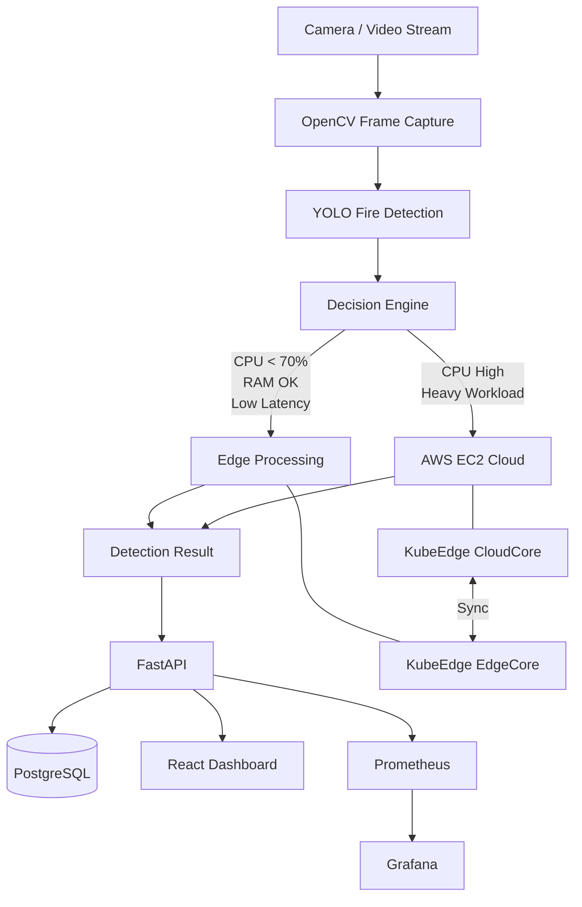

```mermaid
flowchart TD

    A[Camera / Video Stream] --> B[OpenCV Frame Capture]

    B --> C[YOLO Fire Detection]

    C --> D[Decision Engine]

    D -->|CPU < 70%<br/>RAM OK<br/>Low Latency| E[Edge Processing]

    D -->|CPU High<br/>Heavy Workload| F[AWS EC2 Cloud]

    E --> G[Detection Result]

    F --> G

    G --> H[FastAPI]

    H --> I[(PostgreSQL)]

    H --> J[React Dashboard]

    H --> K[Prometheus]

    K --> L[Grafana]

    F --- M[KubeEdge CloudCore]

    E --- N[KubeEdge EdgeCore]

    M <-- Sync --> N
```